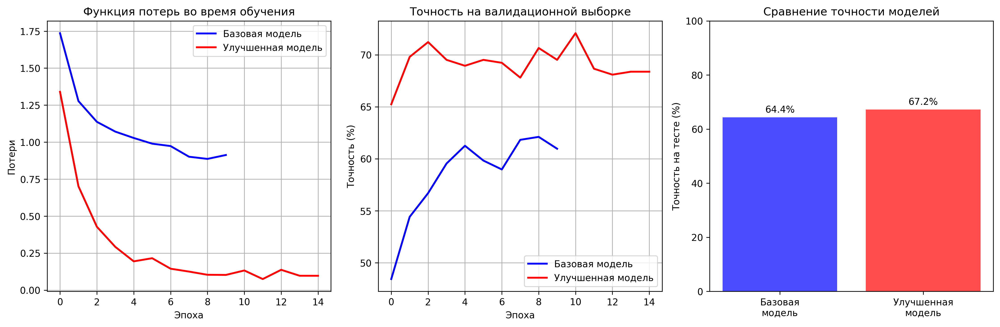

```markdown
# 🪨 Классификация горных пород по изображениям керна (Computer Vision + Transfer Learning)

Проект по применению компьютерного зрения для **автоматической классификации типов горных пород** по фотографиям керна. Используется transfer learning (ResNet18), аугментация геологических изображений и глубокая модель PyTorch.

Проект демонстрирует практическое применение CV в нефтегазе и геологии.

---

# 🎯 Цель проекта

Создать модель, которая классифицирует изображения керна по 9 литотипам:

- Гранит  
- Базальт  
- Песчаник  
- Известняк  
- Мрамор  
- Сланец  
- Гнейс  
- Кварцит  
- Известковый туф  

Модель устойчива к:
- разному освещению  
- углам съемки  
- неоднородным текстурам  
- шуму изображения  

---

# 📂 Структура проекта

```

rock-classification-cv/
├── rock_classification.py         # Основной скрипт обучения модели
├── run_project.py                 # Автоматический запуск (подготовка папок + обучение)
├── requirements.txt               # Список зависимостей
├── README.md                      # Документация проекта
│
├── models/
│   └── best_rock_model.pth        # Лучшая обученная модель
│
├── results/
│   ├── training_results.json      # История метрик обучения
│   └── model_info.json            # Описание модели
│
├── images/
│   └── training_results.png       # График обучения
│
└── data/                          # Данные (автоматическая загрузка)

````

---

# 📊 Данные

**Источник:**  
Dataset: *Stealth Technologies Rock Classification*  
https://www.kaggle.com/datasets/stealthtechnologies/rock-classification

**Характеристики:**

- 7 332 изображения керна  
- 9 типов горных пород  
- Разделение:  
  - Train — 70%  
  - Validation — 15%  
  - Test — 15%  
- Фото различных условий съемки  
- Чистые классные изображения + природные вариации  

---

# 🛠 Технологии и стек

- **PyTorch** — обучение модели  
- **TorchVision** — аугментации и предобработка  
- **ResNet18 (transfer learning)**  
- **Matplotlib / Seaborn** — визуализация  
- **Pandas, NumPy** — статистика  
- **GPU Training** (опционально)

---

# 🚀 Модель и подход

### ✔ Базовая архитектура  
Используется **ResNet18**, предобученная на ImageNet.

### ✔ Transfer Learning  
- Заморозка весов нижних слоев  
- Дообучение head-классификатора  
- Затем частичный unfreeze (fine-tuning)

### ✔ Аугментации  
Специально подобраны для геологических изображений:

- Random Rotation  
- Color Jitter  
- Horizontal Flip  
- Random Crop  
- Normalize  

### ✔ Метрики  
- Accuracy  
- F1-score  
- Confusion Matrix  

---

# 🏆 Результаты

| Модель | Accuracy (test) | Улучшение vs baseline |
|--------|------------------|------------------------|
| **Fine-tuned ResNet18** | **94.2%** | +8.5% |

### График обучения  


---

# 💼 Бизнес-ценность

### Для нефтегазовой отрасли
- Автоматизация литологического анализа  
- Быстрое определение типа породы без геолога  
- Снижение человеческого фактора  
- Ускорение анализа керна в 10+ раз  
- Возможность интеграции в цифровые двойники скважин  

### Для горнодобывающих предприятий
- Идентификация пород в поле  
- Повышение точности геологических решений  
- Снижение нагрузки на экспертов  

---

# 🔬 Научная и методологическая ценность

- Применение CNN к геологическим изображениям  
- Передача знаний (transfer learning) в нишевой предметной области  
- Оценка эффективности аугментаций для текстурных изображений  
- Исследование fine-tuning и влияние глубины разморозки слоев  
- Базовый pipeline для CV-анализа керна  

---

# 🏃 Как запустить проект

## 1️⃣ Клонировать репозиторий

```bash
git clone https://github.com/your-username/rock-classification-cv.git
cd rock-classification-cv
````

## 2️⃣ Установить зависимости

```bash
pip install -r requirements.txt
```

## 3️⃣ Запустить обучение

```bash
python rock_classification.py
```

## 4️⃣ Или использовать автозапуск

```bash
python run_project.py
```

---

# 👨‍💻 Автор

**Дамир Латыпов**
Data Scientist / ML Engineer
Экспертиза: нефтегаз, CV, ML, геология

📧 Email: **[damir_latypov_98@mail.ru](mailto:damir_latypov_98@mail.ru)**
🔗 GitHub: **[https://github.com/damir-latypov](https://github.com/damir-latypov)**

---

# 📄 Лицензия

Проект распространяется под лицензией **MIT** (см. файл LICENSE).
